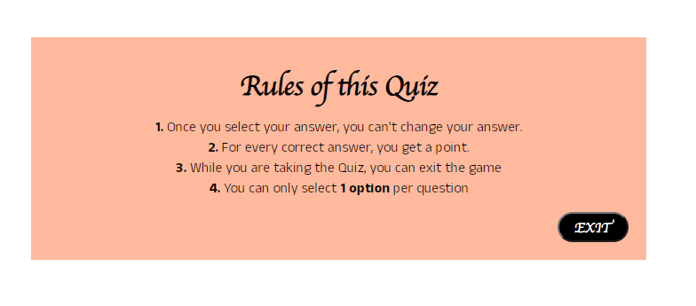

# Quiz-Project 2

## Quiz Game
A trivia quiz. The quiz is for music lovers that wants to test their knowledge.

# User Experience (UX)
## User stories

Goals for a first time user:

- I want the user to understand the intention of the website.
- I want the user to be able to easily find the rules of the quiz and understand how to play.
- I want the user to quickly be answering the quiz questions without confusion.
- I want the user to see the question number and their score as they progress through the quiz.
- I want the user to able to see their highscores logged after quiz game.
- I want the user to be able to go back and see the logged results in the leaderboard
- I want the user to be able to clear their highscore from the leaderboard.

# Wireframes

## Wireframe Website/Mobile Homepage

## Wireframe Website/Mobile Quiz game

## Wireframe Website/Mobile End of Quiz game

## Wireframe Website/Mobile Rules

## Wireframe Website/Mobile Leaderboard

# Features

## Homepage

A simple homepage with clear navigation where the user can choose between playing the quiz game, reading the rules or going straight to leaderboard.
The buttons have an effect and turns to white if the user put the mouse over selected button.

## Quiz Game

The Quiz game page shows a quiz question with 4 different options. If the user chooses a question the option button will either turn green or red depending on if the answer is right or wrong.
On this page there is a question counter that increases by every question the user answers. There is also a score counter that also increases but only for each correct answer. 
If the user wants to exit the game, there is a exit button at the bottom right that will take the user to homepage. 

## Rules

The rules page is very simplistic with clear instructions about how the quiz game should be played. Very straight forward and easy to understand which the user will appreciate. 

## End of Quiz

At the end of the quiz the user will encounter a page where they can enter their name to save their score. There will also be an option where the user can either choose to play the game again or exit the game and return to the homepage.

## Leaderboard

This page is where the highscores is saved. After the user have saved their score in the end of the quiz. This is the board that will save all the scores up to 6 times, after that the leadng highscores is the scores that will be shown in the leaderboard.
The user also have a choice to clear the leaderboard or press exit button and return to homepage.

# Flowchart

This is a short flowchart that describes how the quiz game works.

.png)

# API

## Trivia API

The Open Trivia Database provides a completely free JSON API for use in programming projects

# Technology Stack

## Languages Used

- HTML
- CSS
- Javascript

## Frameworks, Libraries and Programs Used

- Font Awesome
- Remicon
- Git
- Github
- Gitpod
- Google Chrome DevTools
- Google Fonts

# Validator Testing

W3C Markup Validator was used to check the markup validity of the HTML for technical quality and correctness, and no errors found.

W3C CSS Validation Service was used to check the markup validity of the CSS for technical quality and correctness, and no errors found.

Chromes Lighthouse

# Deployment
## Project Setup:

- Create new repository in Github
- Select Code Institute Full Template
- Name and create the repository
- On the repository page, CLICK the green GITPOD button to launch GITPOD
- Commands used for version control during the project;
 * git add "file name" to add files to stage
 * git commit -m "commit message"
 * git push to push changes through to main in Github

## The website was deployed to Github Pages with the following steps:

- Click on the settings icon at the top of the page in the navigation bar.
- Scroll down untill you see Github Pages.
- There will be a message box saying "Check it out here" Click on the link to take you to the next page.
- Here you will be greated with a form, Choose the repository Quiz-Project2
- Choose the branch in the drop down box, in this case MAIN
- Choose the directory in the next dropp down box, in this case Root.
- Then click Save

It may take a few moments for the site to publish, but once live, the box at the top of the page with the site name will turn green and have a Green tick to the left of the link to the live site.

View Live Project Here

# Acknowledgement
I have thank my Code Institute mentor Narender who have helped along the way and given me guidance and support in my projects.

I have also taken inspiration and lessons from some youtube channels that gave me a couple of informtion about how to code in javascript.

Here is a couple of them:

https://www.youtube.com/watch?v=pQr4O1OITJo

https://www.youtube.com/watch?v=CqddbIrEM5I

https://www.youtube.com/watch?v=bGQ9sIHZdlo

